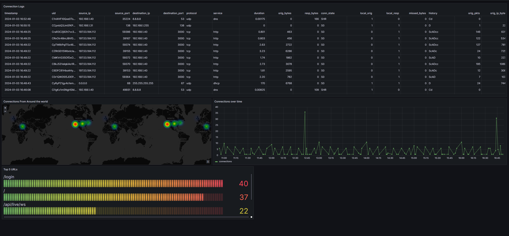

# Clickhouse Zeek Logs Integration

This is how I pushed zeek logs to clickhouse.

# Setup

- Install Zeek on a machine [(Installation)](https://software.opensuse.org//download.html?project=security:zeek&package=zeek)
- Install Fluent Bit on the same machine [(Installation)](https://docs.fluentbit.io/manual/installation/getting-started-with-fluent-bit)
- Install clickhouse on an another machine [(Installation)](https://clickhouse.com/docs/en/install)

## Create Clickhouse Tables

Use the `tables.sql` file in the repo to create the tables in clickhouse like this

```bash
clickhouse client --multiquery < tables.sql
```

## Zeek Logs in JSON format

Go to `/opt/zeek/share/zeek/site/local.zeek` and add line

```zeek
@load policy/tuning/json-logs.zeek
```

## Fluent Bit Configuration

Remove all the config after the [SERVICE] part and append this this to `/etc/fluent-bit/fluent-bit.conf`

```conf
@INCLUDE zeek/conn.conf
@INCLUDE zeek/ssh.conf
@INCLUDE zeek/dns.conf
@INCLUDE zeek/http.conf
```

Append this to `/etc/fluent-bit/parser.conf`

```conf
[PARSER]
    Name        zeek_json
    Format      json
    Time_Key    ts
    Time_Format %s.%L
```

Then, copy and paste all the contents of `fluent-bit/zeek/` to `/etc/fluent-bit/zeek`. Make sure the path to the zeek logs is correct and the server config for clickhouse is setup correctly and the lua script as well.

## Grafana

By Importing the dashboard in the `grafana` folder, and connecting clickhouse to grafana, you can make dashboards that look like this. For the map to work, follow this [guide](https://clickhouse.com/blog/geolocating-ips-in-clickhouse-and-grafana)


